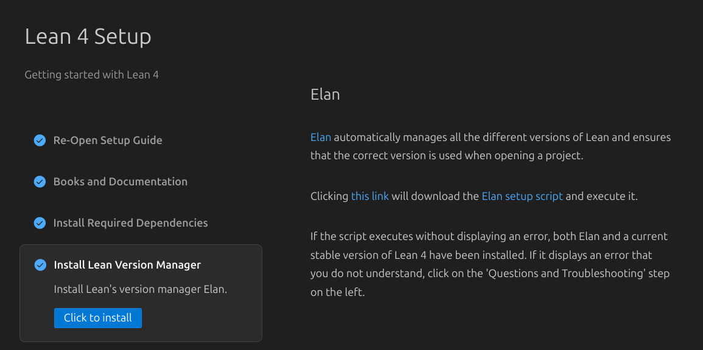
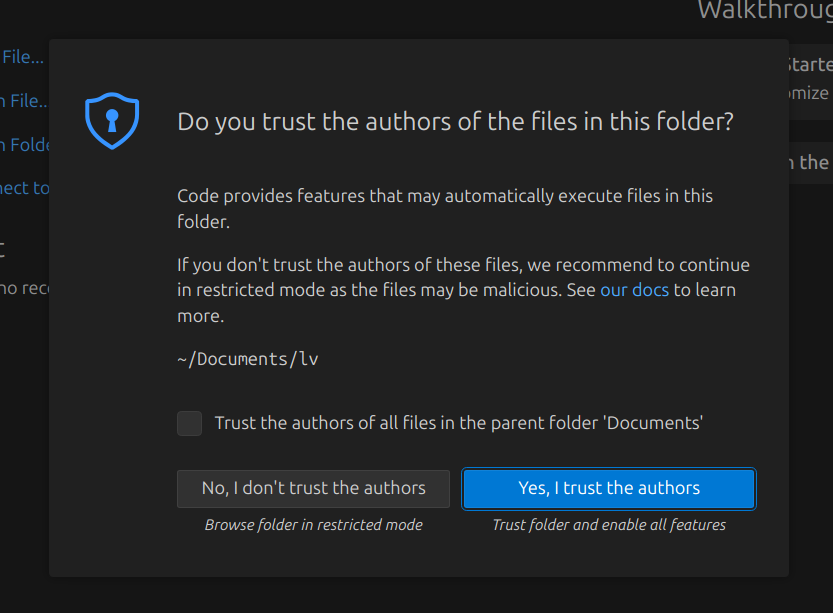
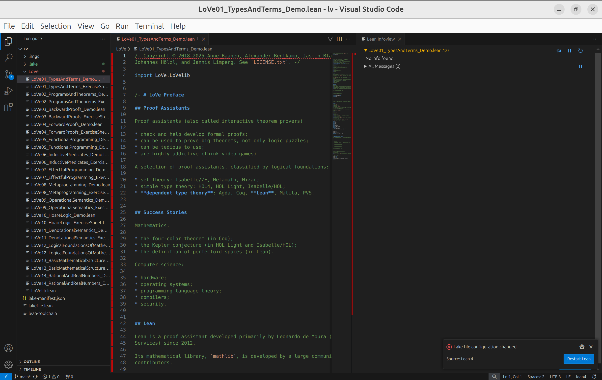
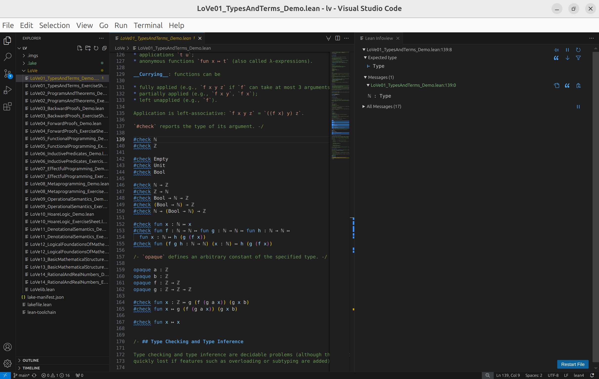

# Logical Verification 2024-2025

This repository contains the Lean demos and exercise sheets used in the course
_Logical Verification_ at the Vrije Universiteit Amsterdam for the academic year
2024-2025.

## Installation instructions

We will be using Visual Studio Code as our editor of choice in this course, as
it has very good integration with Lean. To get started, first install
[VS Code](https://code.visualstudio.com/).

Once you have installed VS Code, launch it and install the Lean 4 extension, by
clicking on the 'Extensions' sidebar entry and searching for 'Lean 4':


When the extension has been installed, it should open a Setup Guide.
Make sure to follow the steps _Install Required Dependencies_ and
_Install Lean Version Manager_.



Once those are set up, open a terminal (_Terminal => New Terminal_),
navigate to the location where you would like to have the course files, and
run the following command to clone this repository:

```bash
git clone https://github.com/vu-logical-verification/logical_verification_2024
```


Open the folder in VS Code (_File => Open Folder..._), and open the first demo
(`LoVe01_TypesAndTerms_Demo.lean`). You may be asked whether you trust the
authors of the files in this folder; say _Yes, I trust the authors_, as this
is required to make the Lean 4 extension work.



Wait for the Lean 4 extension to detect the Lean project, install the right
version of Lean, etc. At some point, it should pop up a message about the
Lake configuration having changed:



At this point, you will want to get the Mathlib build cache. This allows us to
skip the long step of building the dependencies of our project. To do so,
click the forall symbol in the top right of the editor pane, and select
_Project Actions... => Project: Fetch Mathlib Build Cache_.


This will take a little bit of time, but all you have to do is wait. Once the
build cache has been fetched, Lean will be restarted, and a message about
imports being out of date should appear. Simply click _Restart File_ in the
lower right corner of the Infoview. If all is well, the setup should be done!
When you now scroll down to the line "#check ℕ", a message should appear in the
Infoview telling you that "ℕ : Type".



## Troubleshooting
If anything goes wrong during the installation process, please stop by at one
of the practical sessions, and we will be happy to help you get started :^).
